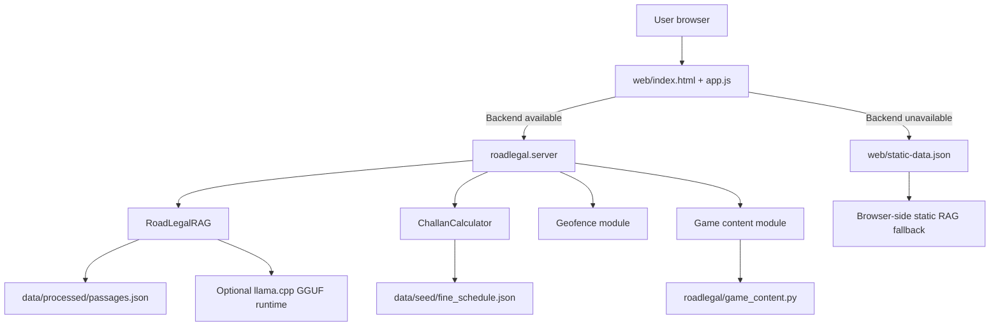

# RoadLegal Development, Technical, and Support Guide

Version: 0.1.0  
Repository: https://github.com/HopeChanphot/roadlegal  
Primary public demo target: https://hopechanphot.github.io/roadlegal/  
Local development URL: http://127.0.0.1:8000/

## 1. Executive Summary

RoadLegal is an offline-first AI road-safety and traffic-law assistant designed for the BIMSTEC Road Safety Hackathon 2026. The app helps road users ask legal and safety questions, estimate traffic penalties through a challan calculator, switch between BIMSTEC country contexts, and learn safer road behavior through quizzes and scenario games.

The project is intentionally built as a lightweight, deployable MVP. It does not depend on a paid cloud AI API. Instead, it uses local retrieval-augmented generation (RAG) over packaged legal and safety passages. When a local `llama.cpp` GGUF model is available, the backend can call it for generative answers. When no model is available, RoadLegal falls back to deterministic extractive RAG answers with citations. The GitHub Pages version also runs without a backend by using packaged static data in the browser.

The design goal is legal caution over false confidence. If a country's fine schedule has not been verified from current official notices, RoadLegal marks the record as `needs_review` instead of inventing a fine.

## 2. Product Goals

RoadLegal was built around the DriveLegal problem statement:

- Provide location-specific traffic-law information.
- Calculate challan or fine estimates based on offence, vehicle class, and jurisdiction.
- Support countries with different legal and infrastructure contexts.
- Work offline or in low-connectivity environments.
- Improve road-safety behavior through interaction, not only static awareness.
- Give source-backed answers with legal-review status.
- Be easy to demo, host, and extend.

## 3. Current Capabilities

### 3.1 Chat

The chat supports questions such as:

- What is the fine for overspeeding in India for a car?
- What are Thailand helmet rules for scooter passengers?
- What happens for drink driving?
- What documents should I carry while driving in Thailand?
- Give me a cross-border checklist for India to Bangladesh.

The backend returns:

- Grounded answer text.
- RAG mode, such as `extractive-rag` or `static-rag`.
- Selected jurisdiction.
- Citations.
- Structured fine estimate when detected.
- Local model status.

### 3.2 Challan Calculator

The calculator maps:

- Jurisdiction.
- Offence.
- Vehicle class.
- Fine amount or verification status.
- Legal basis.
- Consequences.
- Caveats.
- Source URL.

India currently has the strongest verified starter coverage. Thailand has expanded offence coverage, but fine amounts remain marked for current schedule review.

### 3.3 Country and Jurisdiction Switching

The menu labeled `Country / law area` changes:

- Chat jurisdiction context.
- Calculator offence list.
- Quiz and scenario content.
- Directory contacts.
- Country profile card.
- Quick prompt labels.

Current country/jurisdiction records:

- India.
- Delhi, India.
- Bangladesh.
- Bhutan.
- Nepal.
- Sri Lanka.
- Thailand.
- Myanmar.

### 3.4 Gamified Learning

The game module includes:

- Multiple-choice safety quizzes.
- Country-specific scenarios.
- Local score saved in browser storage.
- Immediate feedback and explanations.

Thailand includes expanded scenario content:

- Left-side traffic adaptation.
- Scooter passenger helmet scenario.
- Monsoon highway speed scenario.
- Tourist driving documents.
- Drink-driving decision scenario.

### 3.5 Static Public Demo

The GitHub Pages version runs without the Python backend. The file `web/static-data.json` packages:

- RAG passages.
- Jurisdictions.
- Fine schedule.
- Quiz content.
- Runtime health data for static mode.

The frontend detects when the backend API is unavailable and automatically switches to static mode.

### 3.6 Cloud Backend

The full backend can run on:

- Local Python.
- Render.
- Railway.
- Any Docker host.

Cloud deployment files included:

- `Dockerfile`
- `render.yaml`
- `railway.json`
- `Procfile`

## 4. High-Level Architecture



The architecture has two modes:

1. Backend mode: Python serves the API and static UI.
2. Static mode: GitHub Pages serves `web/` and the browser performs search/calculation locally.

## 5. Repository Structure

```text
.github/workflows/pages.yml       GitHub Pages static deploy workflow
data/processed/passages.json      Built RAG index
data/raw/downloads/               Ignored raw downloaded source files
data/seed/fine_schedule.json      Structured fine records
data/seed/passages.json           Curated starter RAG passages
data/seed/source_manifest.json    Source download manifest
docs/                             Project documentation
models/                           Optional local GGUF models, ignored except .gitkeep
roadlegal/                        Python backend modules
scripts/build_index.py            Builds processed RAG index
scripts/download_sources.py       Downloads source documents
scripts/export_static_demo.py     Exports web/static-data.json
tests/                            Unit tests
web/                              Frontend and static GitHub Pages app
```

## 6. Backend Module Design

### 6.1 `roadlegal/server.py`

Responsibilities:

- Serves `web/` assets.
- Exposes JSON API endpoints.
- Reads `$PORT` for cloud deployment.
- Instantiates shared RAG and calculator objects.
- Writes feedback to local log.

Important behavior:

- Defaults to `127.0.0.1:8000` for local runs.
- Uses `0.0.0.0` for cloud/Docker.
- Returns JSON with UTF-8 encoding.
- Uses only Python standard library HTTP server components.

### 6.2 `roadlegal/rag.py`

Responsibilities:

- Loads processed passages.
- Builds an in-memory lexical index.
- Scores passages using BM25-style term matching.
- Boosts jurisdiction-specific results.
- Detects fine-related questions.
- Produces grounded extractive answers.
- Calls optional local LLM runtime if available.

RAG flow:

1. Normalize user message.
2. Infer jurisdiction hints from text when possible.
3. Retrieve top passages from local index.
4. Attempt structured challan calculation if offence terms are detected.
5. Build a prompt for optional local LLM.
6. If LLM output is available, return generative RAG.
7. Otherwise return extractive RAG with citations.

### 6.3 `roadlegal/challan.py`

Responsibilities:

- Loads `data/seed/fine_schedule.json`.
- Normalizes jurisdiction aliases.
- Normalizes offence aliases.
- Calculates amount display.
- Returns structured results.

Supported status values include:

- `verified`: Starter record is believed to be source-backed.
- `needs_review`: Fine exists conceptually, but exact amount must be verified.
- `not_applicable`: Offence does not apply to selected vehicle class.
- `unknown_offence`: No local structured record exists.
- `unknown_vehicle_class`: Offence exists, but no vehicle record exists.

### 6.4 `roadlegal/llm_runtime.py`

Responsibilities:

- Loads a persistent GGUF model through `llama-cpp-python`.
- Downloads the configured model from Hugging Face when cloud auto-download is enabled.
- Detects local `llama-cli`.
- Detects local `llama-server`.
- Detects GGUF model files in `models/`.
- Detects `ROADLEGAL_GGUF_MODEL`.
- Uses `llama-cli` only as a compatibility fallback when Python bindings are unavailable.

Current local machine status:

- `Qwen3-0.6B-Q8_0.gguf` is downloaded and checksum verified.
- `llama-cpp-python` 0.3.34 loads the model persistently in about 1.4 seconds.
- The app runs in `generative-rag` mode with fast structured-fine bypass and answer caching.
- Extractive RAG remains available automatically if the model cannot load.

Important limitation:

`llama.cpp` cannot directly run safetensors through this app. The model must be converted or downloaded as GGUF.

### 6.5 `roadlegal/geo.py`

Responsibilities:

- Provides starter country-level BIMSTEC bounding boxes.
- Resolves latitude/longitude to likely jurisdiction.
- Handles overlapping bounding boxes by choosing the smallest matching area.
- Provides text-based city hints for simple location inference.

Production upgrade path:

- Replace rough country boxes with state/municipal polygons.
- Add border crossings and road corridor metadata.
- Add offline map tile or geohash support.

### 6.6 `roadlegal/game_content.py`

Responsibilities:

- Provides common safety quiz questions.
- Provides country-specific questions.
- Currently includes expanded Thailand scenario game content.

The frontend calls:

```text
GET /api/quiz?jurisdiction=thailand_national
```

### 6.7 `roadlegal/text.py`

Responsibilities:

- Tokenization.
- Whitespace normalization.
- HTML stripping.
- Text chunking for downloaded source documents.

## 7. Frontend Design

### 7.1 Files

- `web/index.html`: Layout and app structure.
- `web/styles.css`: Responsive app styling.
- `web/app.js`: State, API calls, static fallback, chat, calculator, quiz, geofence, feedback.
- `web/static-data.json`: Generated static demo data.
- `web/.nojekyll`: Prevents GitHub Pages from processing files through Jekyll.

### 7.2 Runtime Modes

The frontend first tries backend API calls.

If backend calls fail:

1. `backendAvailable` is set to `false`.
2. The browser loads `static-data.json`.
3. Static API handlers emulate backend endpoints.
4. Chat uses browser-side lexical retrieval.
5. Feedback is saved to browser `localStorage`.

This makes the same UI work locally, on a cloud backend, and on GitHub Pages.

### 7.3 UI Components

Main areas:

- Top country/language toolbar.
- Runtime status strip.
- Chat panel.
- Country mode card.
- Challan calculator.
- Quiz/game card.
- Directory card.
- Feedback form.

Country switching updates:

- Profile card.
- Offence dropdown.
- Quiz questions.
- Directory entries.
- Quick prompts.
- Chat jurisdiction context.

## 8. Data Model

### 8.1 Passage Schema

Each RAG passage uses:

```json
{
  "id": "thailand:helmet-rule",
  "title": "Thailand motorcycle helmet safety rule",
  "text": "Passage text...",
  "jurisdiction": "thailand_national",
  "country": "Thailand",
  "source_title": "Thailand Land Traffic Act reference translation",
  "source_url": "https://...",
  "tags": ["thailand", "helmet", "motorcycle"],
  "verified": false
}
```

Fields:

- `id`: Stable unique identifier.
- `title`: Short human-readable title.
- `text`: Retrieval content.
- `jurisdiction`: Lookup key.
- `country`: Display country.
- `source_title`: Citation label.
- `source_url`: Citation URL.
- `tags`: Search and topic metadata.
- `verified`: Whether source and interpretation are reviewed.

### 8.2 Fine Schedule Schema

Fine records live in `data/seed/fine_schedule.json`.

Structure:

```json
{
  "jurisdictions": {
    "thailand_national": {
      "name": "Thailand",
      "country": "Thailand",
      "offences": {
        "no_helmet": {
          "label": "Motorcycle helmet violation",
          "legal_basis": "Thailand Land Traffic Act...",
          "source": "https://...",
          "vehicles": {
            "two_wheeler": {
              "amount_display": "Fine amount needs latest schedule verification.",
              "status": "needs_review",
              "consequences": ["Police may stop the rider..."]
            }
          }
        }
      }
    }
  }
}
```

Design principle:

Use `amount_display` for uncertain or textual amounts. Use numeric `fine_min`, `fine_max`, and `currency` only when the amount is verified enough for structured display.

## 9. RAG Pipeline Details

### 9.1 Ingestion

Source manifest:

```text
data/seed/source_manifest.json
```

Downloader:

```powershell
python scripts/download_sources.py
```

Index builder:

```powershell
python scripts/build_index.py
```

The builder:

- Starts with curated seed passages.
- Reads downloaded PDF/HTML/text files.
- Extracts text.
- Splits source material into chunks.
- Adds source metadata.
- Writes `data/processed/passages.json`.

### 9.2 Retrieval

Current retrieval is dependency-light and runs in memory.

Algorithm:

- Tokenize query.
- Build per-passage token counters.
- Compute BM25-like lexical score.
- Boost current jurisdiction.
- Boost global/BIMSTEC safety material.
- Boost direct tag hits.
- Return top ranked passages.

Why lexical first:

- Fast.
- Offline.
- Easy to debug.
- No heavy dependency needed for GitHub Pages or local Python.
- Good enough for the MVP source set.

Planned upgrade:

- Add MiniLM embeddings.
- Use ONNX runtime if available.
- Add hybrid lexical + semantic ranking.
- Add metadata filters by jurisdiction and verified status.

### 9.3 Answer Generation

Answer modes:

- `extractive-rag`: Backend builds answer from retrieved passages.
- `generative-rag`: Backend uses persistent `llama-cpp-python` GGUF inference, with `llama-cli` as a fallback.
- `static-rag`: Browser builds answer from packaged data on GitHub Pages.

The app never silently invents fine amounts. When schedules need review, it says so.

## 10. Local LLM Strategy

### 10.1 Supported Runtime

The backend is designed around `llama.cpp` because:

- It can run quantized models.
- It supports CPU/GPU local inference.
- It can run on offline devices.
- It avoids paid cloud APIs.

### 10.2 Enabling a Model

Option 1: place a GGUF file in `models/`.

```text
models/Qwen3-0.6B-Q8_0.gguf
```

Option 2: set:

```powershell
$env:ROADLEGAL_GGUF_MODEL="C:\path\to\model.gguf"
```

Then run:

```powershell
python -m roadlegal.server --host 127.0.0.1 --port 8000
```

### 10.3 Selected and Future Models

The production demo uses Qwen3-0.6B Q8 GGUF because it is compact, Apache-2.0 licensed, multilingual, and fast enough for a free CPU Space. Future paid-host comparisons may include Phi-4-mini, SmolLM3-3B, or Gemma multimodal variants.

Selection criteria:

- Runs locally within memory constraints.
- Strong multilingual performance.
- Good instruction following.
- License compatible with hackathon/demo distribution.
- Works with `llama.cpp`.

## 11. API Reference

### 11.1 Health

```text
GET /api/health
```

Returns:

```json
{
  "passages": 909,
  "index_file": "...",
  "jurisdictions": ["india_national", "thailand_national"],
  "model": {
    "mode": "generative-rag",
    "engine": "llama-cpp-python",
    "model": "Qwen3-0.6B-Q8_0.gguf",
    "loaded": true,
    "load_seconds": 1.4
  }
}
```

### 11.2 Jurisdictions

```text
GET /api/jurisdictions
```

Returns country/law-area menu records.

### 11.3 Offences

```text
GET /api/offences?jurisdiction=thailand_national
```

Returns calculator offence options.

### 11.4 Chat

```text
POST /api/chat
```

Body:

```json
{
  "message": "What are Thailand helmet rules for scooter passengers?",
  "jurisdiction": "thailand_national",
  "language": "English"
}
```

Returns:

- `answer`
- `mode`
- `jurisdiction`
- `language`
- `citations`
- `fine`
- `model`

### 11.5 Challan Calculation

```text
POST /api/calculate-challan
```

Body:

```json
{
  "jurisdiction": "india_national",
  "offence": "overspeeding",
  "vehicle_class": "light_motor_vehicle"
}
```

### 11.6 Geofence

```text
GET /api/geofence?lat=13.7563&lon=100.5018
```

Returns a rough country-level jurisdiction match.

### 11.7 Quiz

```text
GET /api/quiz?jurisdiction=thailand_national
```

### 11.8 Feedback

```text
POST /api/feedback
```

Backend mode writes to:

```text
data/feedback.log
```

Static mode writes to browser `localStorage`.

## 12. Deployment Guide

### 12.1 Local Development

```powershell
python -m roadlegal.server --host 127.0.0.1 --port 8000
```

Open:

```text
http://127.0.0.1:8000/
```

### 12.2 GitHub Pages Static Hosting

Current repository:

```text
https://github.com/HopeChanphot/roadlegal
```

The static branch is:

```text
gh-pages
```

Recommended GitHub setting:

```text
Settings -> Pages -> Source: Deploy from a branch
Branch: gh-pages
Folder: / (root)
```

Expected public URL:

```text
https://hopechanphot.github.io/roadlegal/
```

If using GitHub Actions instead:

```text
Settings -> Pages -> Source: GitHub Actions
```

Workflow:

```text
.github/workflows/pages.yml
```

### 12.3 Hugging Face Docker Space

The primary cloud target is `HopeChanphot/roadlegal`. Add a GitHub repository secret named `HF_TOKEN` with Hugging Face write permission, then manually run `.github/workflows/huggingface-space.yml`. The workflow creates or updates the Docker Space, preloads Qwen3-0.6B, and exposes `/api/health` on port 7860.

The GitHub Pages frontend is configured to call:

```text
https://hopechanphot-roadlegal.hf.space
```

Free Spaces sleep after inactivity. The frontend times out quickly and continues with its packaged offline index while the model host wakes.

### 12.4 Render

The repo includes:

```text
render.yaml
```

Render setup:

1. Create a new Web Service from GitHub.
2. Select `HopeChanphot/roadlegal`.
3. Use the included Render config.
4. Use the included Docker service definition and a paid instance with sufficient memory.
5. Set `ROADLEGAL_CORS_ORIGIN=https://hopechanphot.github.io`.

### 12.5 Railway

The repo includes:

```text
railway.json
Dockerfile
```

Railway setup:

1. New Project.
2. Deploy from GitHub repository.
3. Select RoadLegal.
4. Railway builds from Dockerfile.
5. Open the generated Railway domain.

### 12.6 Docker

```powershell
docker build -t roadlegal .
docker run -p 8000:8000 roadlegal
```

## 13. Development Workflow

### 13.1 Add New Law Source

1. Add source metadata to:

```text
data/seed/source_manifest.json
```

2. Download:

```powershell
python scripts/download_sources.py
```

3. Rebuild index:

```powershell
python scripts/build_index.py
```

4. Export static demo:

```powershell
python scripts/export_static_demo.py
```

5. Test:

```powershell
python -m unittest discover -s tests
```

6. Commit and push.

### 13.2 Add New Fine Schedule

1. Verify current official source.
2. Update `data/seed/fine_schedule.json`.
3. Use `needs_review` if not fully verified.
4. Add or update tests.
5. Export static demo data.

### 13.3 Add New Quiz Content

1. Update `roadlegal/game_content.py`.
2. Add questions under `COUNTRY_QUESTIONS`.
3. Keep `answer` as zero-based index.
4. Add a test if the country has special content.
5. Export static data.

### 13.4 Add New Country

Required files:

- `data/seed/fine_schedule.json`
- `data/seed/passages.json`
- `data/seed/source_manifest.json`
- `roadlegal/geo.py`
- `roadlegal/game_content.py` if adding game content
- `web/app.js` country profile and directory

Then rebuild:

```powershell
python scripts/build_index.py
python scripts/export_static_demo.py
python -m unittest discover -s tests
```

## 14. Testing and Verification

Current test command:

```powershell
python -m unittest discover -s tests
```

Current tests cover:

- India overspeeding fine.
- Bangladesh cautious review status.
- Bangladesh geofence matching.
- RAG citation path.
- Thailand expanded law/game content.

Additional manual checks:

```powershell
Invoke-RestMethod http://127.0.0.1:8000/api/health
Invoke-RestMethod "http://127.0.0.1:8000/api/offences?jurisdiction=thailand_national"
Invoke-RestMethod "http://127.0.0.1:8000/api/quiz?jurisdiction=thailand_national"
```

Frontend checks:

- App loads at `/`.
- Country menu contains Thailand and other BIMSTEC countries.
- Switching country updates profile card.
- Calculator offence list changes.
- Quiz changes.
- Chat returns citations.
- Static GitHub Pages demo works without backend.

## 15. Legal Accuracy and Review Policy

RoadLegal is informational and not legal advice.

Accuracy rules:

- Prefer official government, court, police, or transport department sources.
- Mark uncertain records as `needs_review`.
- Do not copy fines between countries.
- Do not quote an exact amount unless it has a current source.
- Include caveats for state/municipal variation.
- Preserve source URLs.
- Separate safety advice from legal claims.

Review statuses:

- `verified`: Source-backed starter data.
- `needs_review`: Source or amount must be checked.
- `not_applicable`: Offence does not apply to selected vehicle class.
- `unknown_offence`: No local data.

Recommended legal-data release process:

1. Collect official source.
2. Extract relevant provision.
3. Add source title and URL.
4. Add structured fine record.
5. Add review date.
6. Add reviewer name or role if available.
7. Rebuild index and static data.
8. Test representative queries.

## 16. Privacy and Security

### 16.1 Local Mode

Local backend mode:

- Runs on the user's machine.
- Does not require paid API keys.
- Stores feedback in `data/feedback.log`.
- Does not send chat messages to external AI services.

### 16.2 Static Mode

GitHub Pages mode:

- Runs in the browser.
- Loads packaged static data.
- Saves feedback only to browser `localStorage`.
- Does not use a server database.

### 16.3 Cloud Backend Mode

If deployed on Hugging Face Spaces, Render, or Railway:

- Requests pass through the cloud server.
- Add a privacy notice before production use.
- Avoid storing precise location unless explicitly needed.
- Consider log redaction.
- Add HTTPS-only hosting.

### 16.4 Model Safety

The LLM is only given retrieved context, a structured fine record, and the user question. The system prompt restricts answers to that evidence, and a post-generation guard rejects unsupported numbers, citation ids, imprisonment, suspension, or revocation claims.

Production additions:

- Refusal/uncertainty rules for legal questions.
- Prompt-injection filtering for downloaded documents.
- Citation requirement enforcement.
- Automated answer evaluation.

## 17. Support Information

### 17.1 User Support

For users:

- Use the country menu before asking a legal question.
- Use the calculator for fine estimates.
- Check citations shown below answers.
- Treat `needs_review` as a warning that the amount is not final.
- Verify urgent matters with local traffic police, transport department, or legal aid.

### 17.2 Maintainer Support

For maintainers:

- Keep source links in `data/seed/source_manifest.json`.
- Keep structured fine data in `data/seed/fine_schedule.json`.
- Rebuild `data/processed/passages.json` after data changes.
- Rebuild `web/static-data.json` before GitHub Pages deployment.
- Run tests before pushing.

### 17.3 Issue Categories

Recommended GitHub issue labels:

- `legal-data`
- `bug`
- `deployment`
- `country-coverage`
- `quiz-content`
- `llm-runtime`
- `frontend`
- `accessibility`

### 17.4 Support Template

When reporting an issue, include:

```text
Country/jurisdiction:
Question or offence:
Vehicle class:
Expected result:
Actual result:
Source link if available:
Screenshot if UI issue:
Browser/device:
Backend or GitHub Pages mode:
```

## 18. Troubleshooting

### 18.1 GitHub Pages Returns 404

Likely cause:

- Pages is not enabled.
- Branch/folder setting is wrong.
- Deployment has not completed.

Fix:

```text
Settings -> Pages -> Source: Deploy from a branch
Branch: gh-pages
Folder: / (root)
Save
```

Wait 1 to 3 minutes.

### 18.2 Static Demo Loads but Chat Fails

Check:

- `web/static-data.json` exists.
- Browser console has no JSON load error.
- GitHub Pages has deployed the latest `gh-pages` branch.

Regenerate:

```powershell
python scripts/export_static_demo.py
git subtree push --prefix web origin gh-pages
```

### 18.3 Backend Starts but Model Is Not Generative

Check `/api/health`.

If mode is `extractive-rag`, the GGUF or a compatible inference engine was not found or could not load.

Fix:

- Put a GGUF model in `models/`.
- Or set `ROADLEGAL_GGUF_MODEL`.
- Install `llama-cpp-python` from `requirements-cloud.txt`.
- Check the `note` field for a download, checksum, memory, or model-format error.

### 18.4 Downloader Fails

Possible causes:

- Network blocked.
- Source moved.
- SSL/certificate problem.
- Government site blocks automated requests.

Fix:

- Open the URL manually.
- Update `source_manifest.json`.
- Add a reviewed seed passage manually if redistribution is not allowed.

### 18.5 Wrong Fine Amount

Fix:

1. Find current official schedule.
2. Update `fine_schedule.json`.
3. Add caveat/source.
4. Rebuild static data.
5. Add or update test.

### 18.6 Country Menu Does Not Update Content

Check:

- `GET /api/offences?jurisdiction=...`
- `GET /api/quiz?jurisdiction=...`
- `web/app.js` `countryProfiles` and `directory`.

## 19. Accessibility and Localization

Current support:

- Simple text-first UI.
- Country/language menu.
- Keyboard-friendly controls.
- Plain explanations.
- Offline static mode.

Planned improvements:

- Voice input.
- Offline text-to-speech.
- Local language translations.
- Larger low-literacy mode.
- Icon-assisted explanations.
- Screen-reader audit.
- Color contrast audit.

## 20. Performance Notes

Current performance:

- Backend loads RAG index into memory.
- Static demo loads a 1.6 MB JSON file.
- No database required.
- No vector server required.

Potential optimizations:

- Split static data by country.
- Lazy-load country data after menu selection.
- Compress static JSON on CDN.
- Add precomputed search index.
- Add service worker caching.
- Add ONNX embeddings when runtime is available.

## 21. Known Limitations

- Country geofencing uses rough bounding boxes, not official boundaries.
- Many BIMSTEC fine schedules are starter/review-needed.
- Thailand has expanded content but exact fine amounts still need current official schedule review.
- GitHub Pages mode is static and cannot persist server-side feedback.
- Local LLM generation requires GGUF, not safetensors.
- No user accounts or synced leaderboard yet.
- No production legal review workflow with signoff metadata yet.

## 22. Roadmap

Short term:

- Enable GitHub Pages setting for public static demo.
- Add issue templates.
- Add more official Thailand fine sources.
- Add Bangladesh, Nepal, Bhutan, Sri Lanka, and Myanmar fine schedules.
- Add review dates to fine records.

Medium term:

- Add semantic retrieval.
- Add speech input/output.
- Add service worker offline cache.
- Add state/city geofencing.
- Add admin data-review tool.

Long term:

- Mobile app wrapper.
- On-device GGUF model integration.
- Multilingual translation packs.
- Authority-reviewed legal releases.
- School/company challenge leaderboards.

## 23. Source and Reference Links

Current source manifest includes:

- WHO Road traffic injuries fact sheet: https://www.who.int/news-room/fact-sheets/detail/road-traffic-injuries
- WHO Global status report on road safety 2023: https://www.who.int/publications/i/item/9789240086517
- India Motor Vehicles Act, 1988: https://www.indiacode.nic.in/bitstream/123456789/9460/1/a1988-59.pdf
- Bangladesh Road Transport Act, 2018: http://bdlaws.minlaw.gov.bd/act-1262.html
- Nepal Motor Vehicles and Transport Management Act starter link: https://lawcommission.gov.np/en/wp-content/uploads/2021/01/Motor-Vehicles-and-Transport-Management-Act-2049-1993.pdf
- Bhutan Road Safety and Transport Act starter link: https://www.rsta.gov.bt/rstaweb/wp-content/uploads/2018/09/Road-Safety-and-Transport-Act-1999.pdf
- Sri Lanka Motor Traffic Act reference: https://www.lawnet.gov.lk/motor-traffic-2/
- Thailand Land Traffic Act reference translation: https://www.ilo.org/dyn/natlex/docs/ELECTRONIC/71258/76700/F155209158/THA71258%20Eng.pdf
- Thailand Department of Land Transport: https://www.dlt.go.th/
- Royal Thai Police: https://www.royalthaipolice.go.th/
- Myanmar Vehicle Law reference: https://www.myanmar-law-library.org/law-library/laws-and-regulations/laws/myanmar-laws-1988-until-now/union-solidarity-and-development-party-laws-2010-2016/myanmar-vehicle-law-2015.html

## 24. Maintainer Checklist

Before a release:

- Run unit tests.
- Validate JSON files.
- Rebuild RAG index.
- Export static demo data.
- Test local backend.
- Test GitHub Pages static mode.
- Check `/api/health`.
- Verify citations for demo questions.
- Confirm `needs_review` is present for unverified legal amounts.
- Commit and push.
- Push `web/` to `gh-pages` if using branch-based Pages.

Commands:

```powershell
python scripts/build_index.py
python scripts/export_static_demo.py
python -m unittest discover -s tests
python -m json.tool data/seed/fine_schedule.json
python -m json.tool data/seed/passages.json
python -m json.tool web/static-data.json
git status
```

## 25. Final Notes

RoadLegal is designed to show a credible path from hackathon demo to deployable public-interest tool. The most important engineering choice is caution: source-backed answers, transparent citations, and explicit review labels are better than confident but wrong legal claims.

The app is already useful as:

- A local offline demo.
- A GitHub Pages static public demo.
- A small cloud-hosted Python backend.
- A foundation for future mobile/offline RAG work.
